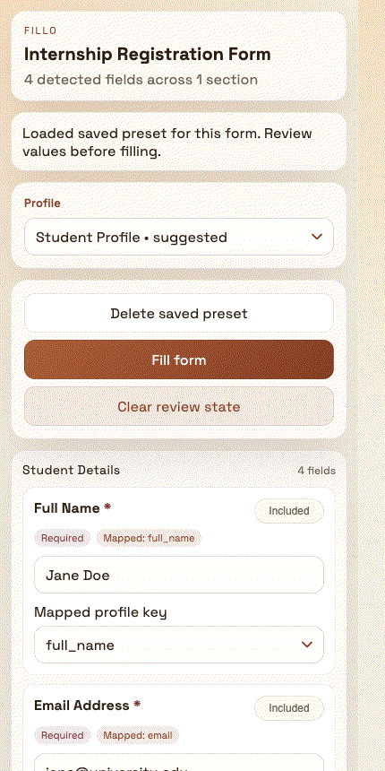

  <h1>Fillo</h1>
  
<strong>Fill Google Forms faster with reusable profiles, form-aware presets, and a review-first workflow.</strong>

  

    
    
    
  

  <strong>Fillo</strong> is built specifically for <code>docs.google.com/forms/...</code> and helps you reuse the same answers without repetitive typing.

## Why **Fillo**

- Scan the active Google Form directly from the popup
- Reuse saved profile values across similar forms
- Review and adjust answers before filling
- Keep everything local in browser extension storage
- Fill fields without auto-submitting the form

## What It Helps With

**Fillo** is useful when you repeatedly fill application forms, registrations, surveys, internship forms, event forms, or other Google Forms that reuse the same personal details.

Instead of typing the same values over and over, you can keep reusable profiles, map them to form fields, and fill supported questions in a few clicks.

## Demo

  

## How It Works

1. Open a supported Google Form.
2. Launch **Fillo** from the browser extension popup.
3. Let **Fillo** scan the form and detect supported fields.
4. Review the suggested values or choose a saved profile.
5. Fill the form without submitting it.

## Highlights

- Form scanning from the popup
- Reusable profiles for common personal data
- Per-form presets saved locally
- Import and export support from the options page
- Review-first workflow instead of blind autofill
- Lightweight extension experience focused on speed

## Browser Support

- Chrome
- Firefox

## Supported Field Types

- Text inputs
- Textareas
- Radio questions
- Checkboxes
- Dropdowns
- Linear scale questions
- Rating-style questions
- Date fields
- Time fields
- Grid questions

## Privacy

- Your saved profiles and presets stay in local browser extension storage.
- **Fillo** fills values into the form only.
- **Fillo** does not auto-submit the form for you.

## Best For

- Internship and job application forms
- Student registrations
- Event registrations
- Repetitive admin forms
- Any Google Form where the same answers are used often

## License

MIT
